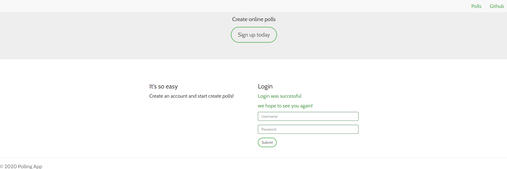
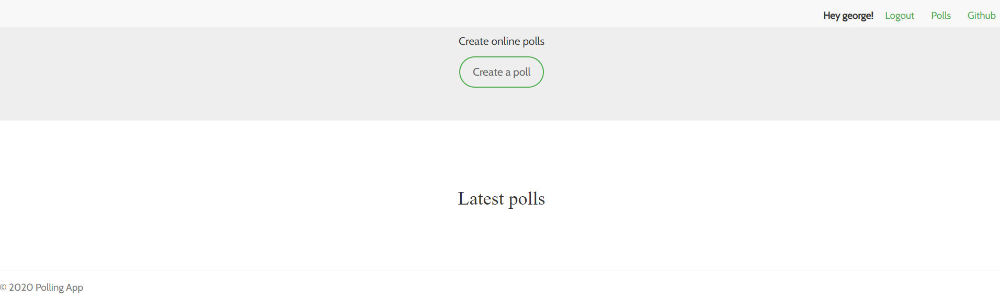
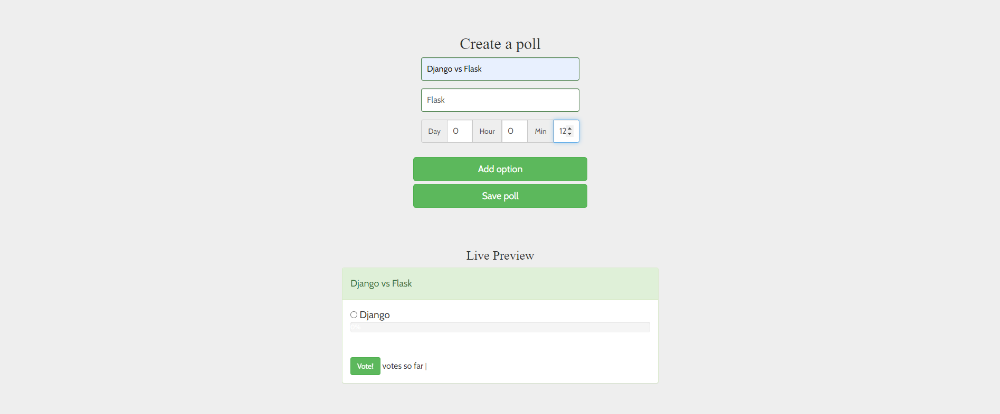
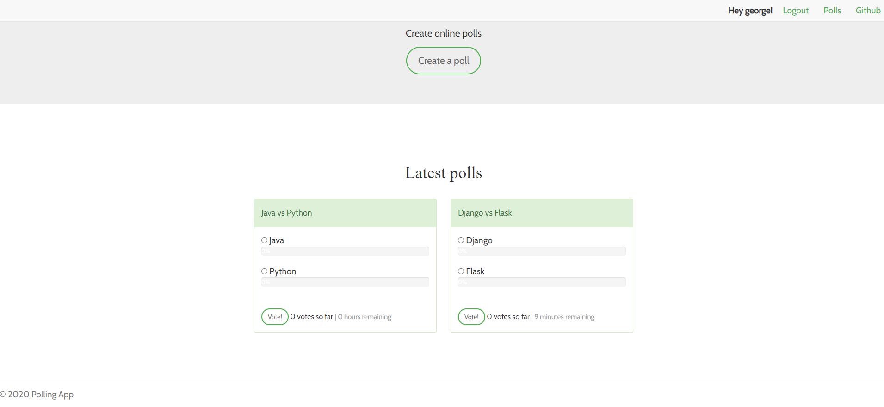
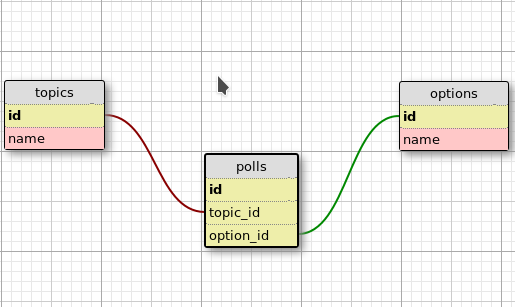

# Polling App
This Server Side Rendering app is based on [Osaetin Daniel blog](https://danidee10.github.io/2016/09/18/flask-by-example-1.html) and built upon it.
It uses:
* **Front End**
* Server-Side React Rendering
* Bootstrap3
* **Back End**
  * Flask
  * Flask-SQLAlchemy
  * Flask-Admin
  * Flask-Migrate
* **Background jobs**
  * Celery
  * Rabbitmq
* **Database**
  * Sqlite
  
 The Polling app has the following features:
 * A basic authentication system
 * Ability to vote on various topics
 * Interactive progress bars to show the percentage of votes

# Login Page
After running the app, from your Web Browser type this link: http://127.0.0.1:5000/ and the welcome page will show the login page.
Create an account and start creating polls


# Create a Poll
From the main page click on Create a Poll, create a poll and check the latest polls
## Main Page

## Create Poll Page
Create a poll and set a timer for the duration of the poll and save the poll

## Main Page with different Polls



# Schema


There's tree tables:
* `topic`    contains all the various topics we're going to be voting on.
            For example "*Django vs Flask*".
* `option`  contains the voting options the users can choose when voting which would be(*Django or Flask*)
* `polls`   serves as a `join` table(ManyToMany relationship)between topics and options,this table is needed
            because of the nature of the voting system where each option can belong to more than one topic at the same time.
            

# Setup     
Use python 3.6 or higher

## Clone the project 
Clone the project via https
```shell script
# git clone https://github.com/georgeerol/PollingApp.git
```
## Install requirements
Run this command on the root folder to install all requirements
```shell script
# pip install -r requirements.txt
```
## Run app
from the root folder cd to the `src` folder and run:
```shell script
# python app.py
```

## Run App with Celery and Rabbitmq
### For Mac or Linux
To run the app with celery first install homebrew then install rabbitmq with homebrew install and finally start rabbitmq
```shell script
# brew install rabbitmq
# brew services start rabbitmq
```
then open a new terminal and then run the app
```shell script
# python app.py
```

### Rabbitmq with Windows
Download and install [chocolatey]("https://chocolatey.org/docs/installation") and then run this following command from
the command line or from PowerShell:
```shell script
# choco install rabbitmq
``` 
To run rabbitMQ service, `cd` to the install folder of rabbitmq, `C:\Program Files\RabbitMQ Server\rabbitmq_server-3.3.4\sbin`
and then run the follow command to enable the plugin 
```shell script
# rabbitmq-plugins.bat enable rabbitmq_management
``` 
The RabbitMQ service starts automatically. You can stop/reinstall/start the RabbitMQ service from the Start Menu.

### Celery for Windows, Mac and Linux
From a new terminal `cd` to the `src` folder and run below command:
```shell script
# celery -A tasks.celery worker --loglevel=info
```
Note: Start the app before running celery


